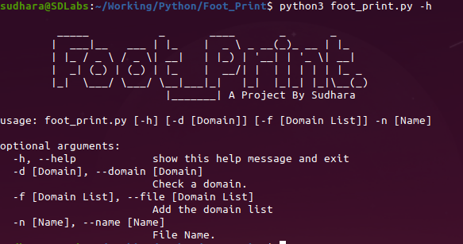

This tool is focused only on passive domain name enumeration via online available databases and tools. The current version of the tool uses,
 - DNSDumpster.com 
 - HackerTarget.com
 - BufferOver.run
 - Shodan.io

 

# Requirements

 - Python3
 - Pandas (PyPI Module)
 - bs4 (PyPI Module)
 - Shodan (PyPI Module)

# Process

This tool will do 

 - A record search (Including Wildcard domains)
 - PTR Record search 
 - MX, NS and TXT data 
 - Getting information about A records via Shodan

# Windows Installation Method:

 - Download the github repository.
 - Open the repository folder using command prompt. (the folder that has foot_print.py (The Foot-Print-master folder))
 - In command prompt, type the following code: `pip install -r requirements.txt`
	 - In some cases pip won't work in command prompt. If so open the 'scripts' folder that's in python installation folder using command prompt and type `pip install -r file-path-of-requirements.txt`
 - Open 'config.json' file using a code editor and type the provided Shodan API key inside the Apostrophes.
 - In command prompt, type the following code: `python foot_print.py -h`
	 - In some cases windows won't run python when a user type python, in that case type 'py foot_print.py -h'. If  still python gives an error set an environment variable for python. `SET PATH=%PATH%;type-python-installation-path-here`

# Linux Installation Method:

 - Download the github repository. (you can use git command)
 - Open the folder using terminal. (the folder that has foot_print.py (The Foot-Print-master folder))
 - Type following command: `pip3 install -r requirements.txt`
 - Open 'config.json' file using a code editor and type the provided Shodan API key inside the Apostrophes.
 - Type following command: `python3 foot_print.py -h`
  
 
# Usage:
 - -h: will provide information regarding the tool
 - -n: name of the output file. (This is mandatory)
 - -d: is to provide a single domain.
 - -f: is to provide a text file that has a list of domains. (The file should be in .txt format and domain should be listed one after other)

**An example code for a single domain:**

 - Linux (open the Foot-Print-master folder using terminal): `python3
   foot_print.py -d uber.com -n Uber_Data`

 - Windows (open the Foot-Print-master folder using command Prompt):
   `python3 foot_print.py -d uber.com -n Uber_Data`

**An example code for a domain list:**
To search a domain list at once, First, make a .txt file containing domains one after other. Then place the domain list text file inside the Foot-Print-master folder

 - Linux (open the  Foot-Print-master folder using terminal): `python3
   foot_print.py -f domainlist.txt -n web_data`

 - Windows (open the Foot-Print-master folder using command Prompt):
   `python3 foot_print.py -f domainlist.txt -n web_data`

# Limitations

 - The tool only works with Python3
 - The tool uses DNSDumpster.com as the primary source. Therefore, if the DNSDumpster daily limit exceeded for the IP, the tool will not be able to process the rest of the functions.
 - The tool will use HackerTarget.com free daily search quota. Also, it can be configured with the API key.
 - Shodan will not work without an API key. Therefore, A Records will not get scanned via Shodan.

